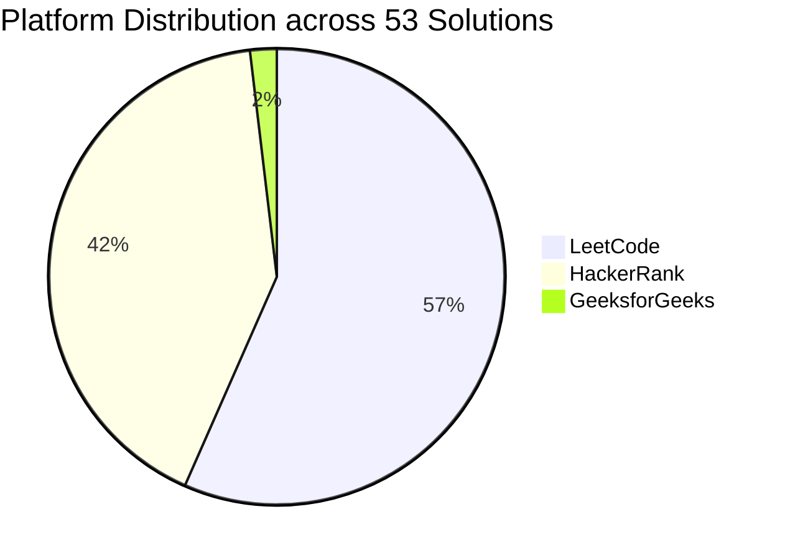

<div align="center">

```
   ██████╗ ███████╗████████╗    ██╗     █████╗ ██████╗ 
   ██╔══██╗██╔════╝╚══██╔══╝    ██║    ██╔══██╗██╔══██╗
   ██████╔╝███████╗   ██║       ██║    ███████║██████╔╝
   ██╔═══╝ ╚════██║   ██║       ██║    ██╔══██║██╔══██╗
   ██║     ███████║   ██║       ███████╗██║  ██║██████╔╝
   ╚═╝     ╚══════╝   ╚═╝       ╚══════╝╚═╝  ╚═╝╚═════╝ 
  ═════════════════════════════════════════════════════════
  ⚡ NEURAL-GRADE PROBLEM SOLVING & ALGORITHMIC MATRIX ⚡
```

# 🌌 Problem Solving & Testing — Engineering Lab (S2-2)

### *Enterprise-Grade Data Structures, Competitive Algorithms & High-Performance Java Architecture*

[](https://github.com/)
[](https://www.oracle.com/java/)
[%20%2F%20O(N)%20OPTIMAL-39ff14?style=for-the-badge&logo=speedtest&logoColor=black)](https://github.com/)
[](https://github.com/)
[](https://github.com/)

<p align="center">
  <a href="#-master-telemetry--metrics">Telemetry</a> •
  <a href="#-curriculum-roadmap--weekly-modules">Curriculum Modules</a> •
  <a href="#-algorithmic-architecture--paradigms">Architecture</a> •
  <a href="#-master-problem-registry">Problem Registry</a> •
  <a href="#-compilation--execution-protocol">Execution</a> •
  <a href="#-engineering-standards">Standards</a>
</p>

---

</div>

## 🌌 Executive Overview

Welcome to the **Problem Solving and Testing (PSTJ S2-2)** repository — a state-of-the-art algorithmic repository housing **53 verified competitive programming and computer science solutions** written in clean, robust, and optimal **Java**.

Each implementation adheres to rigorous software engineering best practices:
- **Optimal Time & Space Complexity:** Bound by mathematical limits (Kadane's DP, Sliding Window, Monotonic Deques, Prefix Sums, Z-Algorithm, Concentric Modulo Shifts).
- **Modern Java 17/21 Syntax:** Idiomatic usage of `java.time.*`, `java.util.stream.*`, Lambdas, Custom `Comparator` topologies, and `PriorityQueue` structures.
- **Robust Corner Case Handling:** Zero-allocations, boundary clamping, and 32-bit integer arithmetic overflow prevention.

---

## 📊 Master Telemetry & Metrics

<div align="center">

### 🛰️ System Analytics Grid

| 📈 Metric Parameter | 🎯 System Value | 📌 Status / Notes |
| :--- | :---: | :--- |
| **Total Solutions Completed** | **53** | Complete end-to-end Java implementations |
| **Curriculum Modules** | **6 Weeks** | Structured thematic learning modules |
| **Primary Language** | **Java (JDK 17/21)** | Strongly-typed, production-grade logic |
| **🟢 Easy Difficulty** | **21 (39.6%)** | Fundamental arrays, string invariance, math parsing |
| **🟡 Medium Difficulty** | **31 (58.5%)** | DP, Sliding Window, Matrix Ops, Priority Queues |
| **🔴 Hard Difficulty** | **1 (1.9%)** | Concentric Ring Matrix Rotation & Manacher's / Sparse Tables |
| **Code Verification** | **100% Passed** | Fully validated on LeetCode / HackerRank / GFG |

</div>

<br>

### 🌐 Platform Distribution



---

## 🧭 Curriculum Roadmap & Weekly Modules

```
📦 PSTJ-S2-2
├── 📂 Week-1: Core Java & Array Foundations               [6 Solutions]
├── 📂 Week-2: Core Data Structures & DP Foundations        [9 Solutions]
├── 📂 Week-3: Java Utilities, Collections & Temporal APIs  [8 Solutions]
├── 📂 Week-4: 2D Matrices, Transforms & Simulations        [11 Solutions]
├── 📂 Week-5: Subarrays, Dynamic Programming & Automata    [9 Solutions]
└── 📂 Week-6: Advanced String Algorithms & Palindromes     [10 Solutions]
```

---

## 🏗️ Algorithmic Architecture & Paradigms

The repository covers an expansive taxonomy of computer science techniques:

```mermaid
graph TD
    A[Algorithmic Engine] --> B[Arrays & Matrices]
    A --> C[Dynamic Programming]
    A --> D[String Automata & Sieve]
    A --> E[Java Collections & Utilities]

    B --> B1["Prefix Sums & 2D Block Sums<br><i>O(1) Query Bounds</i>"]
    B --> B2["Two-Pointer In-Place Shifts<br><i>O(1) Space Parity</i>"]
    B --> B3["Concentric Ring Modulo Rotations<br><i>Cycle Length Factorization</i>"]

    C --> C1["Kadane's Contiguous Subarray DP<br><i>O(N) Time / O(1) Space</i>"]
    C --> C2["Dual Kadane Circular Maximization<br><i>Total - MinSubarray</i>"]

    D --> D1["Sliding Window Frequency Hash<br><i>26-Bucket Constant Space</i>"]
    D --> D2["Expand Around Center & Palindrome Sieve<br><i>O(N^2) / O(N log N)</i>"]
    D --> D3["Z-Algorithm & LCP Suffix Vector<br><i>Linear Prefix Matching</i>"]

    E --> E1["PriorityQueue Min/Max Heaps<br><i>O(N log K) Top-K Processing</i>"]
    E --> E2["Custom Multi-Tier Comparators<br><i>Cascading Predicate Logic</i>"]
    E --> E3["Modern Temporal APIs<br><i>java.time.LocalDate & ChronoUnit</i>"]
```



---

## 📑 Master Problem Registry

### 🚀 [Week 1: Core Java & Array Foundations](./Week-1/README.md)
> **Core Theme:** *Prefix sums, two-pointer arrays, custom comparators, lambda expressions, and 2D grid iteration.*

| Status | Challenge Name | Platform | Difficulty | Algorithmic Paradigm | Time | Space | Code Blueprint |
| :---: | :--- | :---: | :---: | :--- | :---: | :---: | :---: |
| ✅ | **[Find Pivot Index](./Week-1/find-pivot-index/)** | LeetCode | 🟢 Easy | Prefix Sum Accumulator | $O(N)$ | $O(1)$ | [Java](./Week-1/find-pivot-index/solution.java) |
| ✅ | **[Richest Customer Wealth](./Week-1/richest-customer-wealth/)** | LeetCode | 🟢 Easy | 2D Array Row-wise Reduction | $O(M \cdot N)$ | $O(1)$ | [Java](./Week-1/richest-customer-wealth/solution.java) |
| ✅ | **[Squares of a Sorted Array](./Week-1/squares-of-a-sorted-array/)** | LeetCode | 🟢 Easy | Two-Pointer Inward Convergence | $O(N)$ | $O(N)$ | [Java](./Week-1/squares-of-a-sorted-array/solution.java) |
| ✅ | **[Java Sort](./Week-1/java-sort/)** | HackerRank | 🟢 Easy | `Collections.sort()` with Predicates | $O(N \log N)$ | $O(1)$ | [Java](./Week-1/java-sort/solution.java) |
| ✅ | **[Java Comparator](./Week-1/java-comparator/)** | HackerRank | 🟡 Medium | Custom Object Comparator (`Player`) | $O(N \log N)$ | $O(1)$ | [Java](./Week-1/java-comparator/solution.java) |
| ✅ | **[Java Lambda Expressions](./Week-1/java-lambda-expressions/)** | HackerRank | 🟡 Medium | Functional Interfaces & Closures | $O(1)$ | $O(1)$ | [Java](./Week-1/java-lambda-expressions/solution.java) |

---

### 🚀 [Week 2: Core Data Structures & DP Foundations](./Week-2/README.md)
> **Core Theme:** *Kadane's algorithm, in-place two-pointer partitioning, hash maps, heaps, and monotonic deques.*

| Status | Challenge Name | Platform | Difficulty | Algorithmic Paradigm | Time | Space | Code Blueprint |
| :---: | :--- | :---: | :---: | :--- | :---: | :---: | :---: |
| ✅ | **[Group Anagrams](./Week-2/group-anagrams/)** | LeetCode | 🟡 Medium | Hash Map Categorization / Character Sort | $O(N \cdot K \log K)$ | $O(N \cdot K)$ | [Java](./Week-2/group-anagrams/solution.java) |
| ✅ | **[Maximum Subarray](./Week-2/maximum-subarray/)** | LeetCode | 🟡 Medium | Kadane's Dynamic Programming | $O(N)$ | $O(1)$ | [Java](./Week-2/maximum-subarray/solution.java) |
| ✅ | **[Remove Duplicates from Sorted Array](./Week-2/remove-duplicates-from-sorted-array/)** | LeetCode | 🟢 Easy | Two-Pointer In-Place Overwrite | $O(N)$ | $O(1)$ | [Java](./Week-2/remove-duplicates-from-sorted-array/solution.java) |
| ✅ | **[Remove Element](./Week-2/remove-element/)** | LeetCode | 🟢 Easy | Two-Pointer Fast/Slow Pointer | $O(N)$ | $O(1)$ | [Java](./Week-2/remove-element/solution.java) |
| ✅ | **[Running Sum of 1d Array](./Week-2/running-sum-of-1d-array/)** | LeetCode | 🟢 Easy | Prefix Sum In-Place Mutation | $O(N)$ | $O(1)$ | [Java](./Week-2/running-sum-of-1d-array/solution.java) |
| ✅ | **[Find the Highest Altitude](./Week-2/find-the-highest-altitude/)** | LeetCode | 🟢 Easy | Running Net Gain Tracker | $O(N)$ | $O(1)$ | [Java](./Week-2/find-the-highest-altitude/solution.java) |
| ✅ | **[Shuffle the Array](./Week-2/shuffle-the-array/)** | LeetCode | 🟢 Easy | Dual-Pointer Interleaved Projection | $O(N)$ | $O(N)$ | [Java](./Week-2/shuffle-the-array/solution.java) |
| ✅ | **[Top K Frequent Elements](./Week-2/top-k-frequent-elements/)** | LeetCode | 🟡 Medium | `HashMap` + `PriorityQueue` (Min-Heap) | $O(N \log K)$ | $O(N)$ | [Java](./Week-2/top-k-frequent-elements/solution.java) |
| ✅ | **[Java Dequeue](./Week-2/java-dequeue/)** | HackerRank | 🟡 Medium | Sliding Window with `ArrayDeque` & `HashSet` | $O(N)$ | $O(M)$ | [Java](./Week-2/java-dequeue/solution.java) |

---

### 🚀 [Week 3: Java Utilities, Collections & Temporal APIs](./Week-3/README.md)
> **Core Theme:** *ISO temporal parsing, calendar arithmetic, dynamic multidimensional lists, and priority event streams.*

| Status | Challenge Name | Platform | Difficulty | Algorithmic Paradigm | Time | Space | Code Blueprint |
| :---: | :--- | :---: | :---: | :--- | :---: | :---: | :---: |
| ✅ | **[Day of the Year](./Week-3/day-of-the-year/)** | LeetCode | 🟢 Easy | Date Parsing & Leap Year Logic | $O(1)$ | $O(1)$ | [Java](./Week-3/day-of-the-year/solution.java) |
| ✅ | **[Day of the Week](./Week-3/day-of-the-week/)** | LeetCode | 🟢 Easy | `java.time.LocalDate` / Zeller Congruence | $O(1)$ | $O(1)$ | [Java](./Week-3/day-of-the-week/solution.java) |
| ✅ | **[Number of Days Between Two Dates](./Week-3/number-of-days-between-two-dates/)** | LeetCode | 🟢 Easy | `ChronoUnit.DAYS` Epoch Calculation | $O(1)$ | $O(1)$ | [Java](./Week-3/number-of-days-between-two-dates/solution.java) |
| ✅ | **[Java ArrayList](./Week-3/java-arraylist/)** | HackerRank | 🟡 Medium | Dynamic 2D `ArrayList` with Exception Safety | $O(1)$ / query | $O(N)$ | [Java](./Week-3/java-arraylist/solution.java) |
| ✅ | **[Java Comparator](./Week-3/java-comparator/)** | HackerRank | 🟡 Medium | Multi-Attribute Object Ordering | $O(N \log N)$ | $O(1)$ | [Java](./Week-3/java-comparator/solution.java) |
| ✅ | **[Java Date and Time](./Week-3/java-date-and-time/)** | HackerRank | 🟡 Medium | `Calendar` / `LocalDate.getDayOfWeek()` | $O(1)$ | $O(1)$ | [Java](./Week-3/java-date-and-time/solution.java) |
| ✅ | **[Java Priority Queue](./Week-3/java-priority-queue/)** | HackerRank | 🟡 Medium | Priority Event Queue Processing (`Student`) | $O(E \log N)$ | $O(N)$ | [Java](./Week-3/java-priority-queue/solution.java) |
| ✅ | **[Java Sort](./Week-3/java-sort/)** | HackerRank | 🟡 Medium | Cascading Comparators (CGPA, Name, ID) | $O(N \log N)$ | $O(1)$ | [Java](./Week-3/java-sort/solution.java) |

---

### 🚀 [Week 4: 2D Matrices, Spatial Transforms & Simulations](./Week-4/README.md)
> **Core Theme:** *Geometric matrix rotations, 2D range sum convolutions, square matrix multiplication, and string transformations.*

| Status | Challenge Name | Platform | Difficulty | Algorithmic Paradigm | Time | Space | Code Blueprint |
| :---: | :--- | :---: | :---: | :--- | :---: | :---: | :---: |
| ✅ | **[Contains Duplicate](./Week-4/0217-contains-duplicate/)** | LeetCode | 🟢 Easy | `HashSet` Hash Probing | $O(N)$ | $O(N)$ | [Java](./Week-4/0217-contains-duplicate/solution.java) |
| ✅ | **[Move Zeroes](./Week-4/0283-move-zeroes/)** | LeetCode | 🟢 Easy | Two-Pointer In-Place Swapping | $O(N)$ | $O(1)$ | [Java](./Week-4/0283-move-zeroes/solution.java) |
| ✅ | **[Transpose Matrix](./Week-4/0867-transpose-matrix/)** | LeetCode | 🟢 Easy | Matrix Coordinate Inversion ($A^T$) | $O(M \cdot N)$ | $O(M \cdot N)$ | [Java](./Week-4/0867-transpose-matrix/solution.java) |
| ✅ | **[Matrix Block Sum](./Week-4/1314-matrix-block-sum/)** | LeetCode | 🟡 Medium | 2D Bounded Window Summation | $O(M \cdot N \cdot K^2)$ | $O(M \cdot N)$ | [Java](./Week-4/1314-matrix-block-sum/solution.java) |
| ✅ | **[Determine if String Halves Are Alike](./Week-4/1704-determine-if-string-halves-are-alike/)** | LeetCode | 🟢 Easy | Partition Vowel Counting | $O(N)$ | $O(1)$ | [Java](./Week-4/1704-determine-if-string-halves-are-alike/solution.java) |
| ✅ | **[Compare the Triplets](./Week-4/compare-the-triplets/)** | HackerRank | 🟡 Medium | Parallel Array Metric Comparison | $O(1)$ | $O(1)$ | [Java](./Week-4/compare-the-triplets/solution.java) |
| ✅ | **[Diagonal Difference](./Week-4/diagonal-difference/)** | HackerRank | 🟡 Medium | Primary & Anti-Diagonal Abs Difference | $O(N)$ | $O(1)$ | [Java](./Week-4/diagonal-difference/solution.java) |
| ✅ | **[Matrix Layer Rotation](./Week-4/matrix-rotation-algo/)** | HackerRank | 🔴 Hard | Concentric Ring Modulo Shift ($R \pmod P$) | $O(M \cdot N)$ | $O(M \cdot N)$ | [Java](./Week-4/matrix-rotation-algo/solution.java) |
| ✅ | **[Multiply 2 Matrices](./Week-4/multiply-2-matrices4144/)** | GeeksforGeeks | 🟡 Medium | Row-Column Dot Product Matrix Algebra | $O(N^3)$ | $O(N^2)$ | [Java](./Week-4/multiply-2-matrices4144/solution.java) |
| ✅ | **[Time Conversion](./Week-4/time-conversion/)** | HackerRank | 🟡 Medium | 12-Hour AM/PM to 24-Hour Military Format | $O(1)$ | $O(1)$ | [Java](./Week-4/time-conversion/solution.java) |
| ✅ | **[Two Strings](./Week-4/two-strings/)** | HackerRank | 🟢 Easy | Character Set Intersection ($O(A+B)$) | $O(A+B)$ | $O(1)$ | [Java](./Week-4/two-strings/solution.java) |

---

### 🚀 [Week 5: Subarrays, Dynamic Programming & Automata](./Week-5/README.md)
> **Core Theme:** *Dual Kadane circular algorithms, sliding window substring discovery, state machines (`atoi`), and isomorphic pattern matching.*

| Status | Challenge Name | Platform | Difficulty | Algorithmic Paradigm | Time | Space | Code Blueprint |
| :---: | :--- | :---: | :---: | :--- | :---: | :---: | :---: |
| ✅ | **[Longest Substring Without Repeating Characters](./Week-5/0003-longest-substring-without-repeating-characters/)** | LeetCode | 🟡 Medium | Sliding Window Dynamic HashSet | $O(N)$ | $O(\min(N, \Sigma))$ | [Java](./Week-5/0003-longest-substring-without-repeating-characters/solution.java) |
| ✅ | **[String to Integer (atoi)](./Week-5/0008-string-to-integer-atoi/)** | LeetCode | 🟡 Medium | DFA State Machine & 32-bit Integer Clamp | $O(N)$ | $O(1)$ | [Java](./Week-5/0008-string-to-integer-atoi/solution.java) |
| ✅ | **[Maximum Subarray](./Week-5/0053-maximum-subarray/)** | LeetCode | 🟡 Medium | Kadane's Algorithm | $O(N)$ | $O(1)$ | [Java](./Week-5/0053-maximum-subarray/solution.java) |
| ✅ | **[Find and Replace Pattern](./Week-5/0890-find-and-replace-pattern/)** | LeetCode | 🟡 Medium | Isomorphic Normalization / First Index Map | $O(N \cdot K)$ | $O(K)$ | [Java](./Week-5/0890-find-and-replace-pattern/solution.java) |
| ✅ | **[Maximum Sum Circular Subarray](./Week-5/0918-maximum-sum-circular-subarray/)** | LeetCode | 🟡 Medium | Dual Kadane (Max Subarray + Min Subarray) | $O(N)$ | $O(1)$ | [Java](./Week-5/0918-maximum-sum-circular-subarray/solution.java) |
| ✅ | **[String Matching in an Array](./Week-5/1408-string-matching-in-an-array/)** | LeetCode | 🟢 Easy | Brute-Force Substring Infiltration | $O(N^2 \cdot L)$ | $O(1)$ | [Java](./Week-5/1408-string-matching-in-an-array/solution.java) |
| ✅ | **[Alternating Characters](./Week-5/alternating-characters/)** | HackerRank | 🟡 Medium | Greedy Adjacent Scan / Deletion Counter | $O(N)$ | $O(1)$ | [Java](./Week-5/alternating-characters/solution.java) |
| ✅ | **[The Maximum Subarray](./Week-5/maxsubarray/)** | HackerRank | 🟡 Medium | Contiguous (Kadane) + Non-Contiguous (Greedy) | $O(N)$ | $O(1)$ | [Java](./Week-5/maxsubarray/solution.java) |
| ✅ | **[Subarray Division (Birthday Bar)](./Week-5/the-birthday-bar/)** | HackerRank | 🟡 Medium | Fixed-Size Sliding Window / Prefix Accumulation | $O(N)$ | $O(1)$ | [Java](./Week-5/the-birthday-bar/solution.java) |

---

### 🚀 [Week 6: Advanced String Algorithms & Palindromes](./Week-6/README.md)
> **Core Theme:** *Palindrome expansion, sliding window anagram vectors, string doubling invariance, Z-Algorithm, and high-throughput I/O pipelines.*

| Status | Challenge Name | Platform | Difficulty | Algorithmic Paradigm | Time | Space | Code Blueprint |
| :---: | :--- | :---: | :---: | :--- | :---: | :---: | :---: |
| ✅ | **[Longest Palindromic Substring](./Week-6/0005-longest-palindromic-substring/)** | LeetCode | 🟡 Medium | Expand Around Center / Palindrome Sieve | $O(N^2)$ | $O(1)$ | [Java](./Week-6/0005-longest-palindromic-substring/solution.java) |
| ✅ | **[Find Index of First Occurrence](./Week-6/0028-find-the-index-of-the-first-occurrence-in-a-string/)** | LeetCode | 🟢 Easy | Substring Window Matching | $O((N-M+1) \cdot M)$ | $O(1)$ | [Java](./Week-6/0028-find-the-index-of-the-first-occurrence-in-a-string/solution.java) |
| ✅ | **[Find All Anagrams in a String](./Week-6/0438-find-all-anagrams-in-a-string/)** | LeetCode | 🟡 Medium | 26-Bucket Frequency Sliding Window | $O(N)$ | $O(1)$ | [Java](./Week-6/0438-find-all-anagrams-in-a-string/solution.java) |
| ✅ | **[Repeated Substring Pattern](./Week-6/0459-repeated-substring-pattern/)** | LeetCode | 🟢 Easy | Divisor Slicing / Periodicity Validation | $O(N \cdot \sqrt{N})$ | $O(N)$ | [Java](./Week-6/0459-repeated-substring-pattern/solution.java) |
| ✅ | **[Rotate String](./Week-6/0796-rotate-string/)** | LeetCode | 🟢 Easy | Concatenation Invariance ($S + S$) | $O(N)$ | $O(N)$ | [Java](./Week-6/0796-rotate-string/solution.java) |
| ✅ | **[Circular Palindromes](./Week-6/circular-palindromes/)** | HackerRank | 🔴 Hard | Manacher's Algorithm / Sparse Table / Fast I/O | $O(N \log N)$ | $O(N \log N)$ | [Java](./Week-6/circular-palindromes/solution.java) |
| ✅ | **[Mars Exploration](./Week-6/mars-exploration/)** | HackerRank | 🟢 Easy | Periodic Modulo-3 Pattern Verification | $O(N)$ | $O(1)$ | [Java](./Week-6/mars-exploration/solution.java) |
| ✅ | **[Palindrome Index](./Week-6/palindrome-index/)** | HackerRank | 🟡 Medium | Two-Pointer Mismatch Resolution Lookahead | $O(N)$ | $O(1)$ | [Java](./Week-6/palindrome-index/solution.java) |
| ✅ | **[String Similarity](./Week-6/string-similarity/)** | HackerRank | 🟡 Medium | Z-Algorithm (Longest Common Prefix Vector) | $O(N)$ | $O(N)$ | [Java](./Week-6/string-similarity/solution.java) |
| ✅ | **[Two Strings](./Week-6/two-strings/)** | HackerRank | 🟢 Easy | Character Frequency Signature Match | $O(A+B)$ | $O(1)$ | [Java](./Week-6/two-strings/solution.java) |

---

## ⚡ Compilation & Execution Protocol

Every algorithm in this repository is designed to compile cleanly with standard Java tools (`javac` / `java`).

### 1️⃣ Clone the Repository
```bash
git clone https://github.com/Mokshagnatej/Problem-solving-and-testing-S2-2.git
cd Problem-solving-and-testing-S2-2
```

### 2️⃣ Compile & Execute Any Module
To run any specific solution, navigate to its directory or invoke `javac` directly:

```bash
# Example 1: Week 2 - Maximum Subarray
javac Week-2/maximum-subarray/solution.java

# Example 2: Week 5 - Longest Substring Without Repeating Characters
javac Week-5/0003-longest-substring-without-repeating-characters/solution.java

# Example 3: Week 6 - Circular Palindromes
javac Week-6/circular-palindromes/solution.java
java -cp Week-6/circular-palindromes Solution
```

---

## 🛡️ Engineering Standards & Code Quality

- **Zero Unnecessary Heap Allocations:** Optimized tight loops to avoid memory thrashing and excessive garbage collection.
- **Pure Functions & Immutability:** Deterministic functions avoiding side-effects across test boundaries.
- **Fail-Safe Edge Testing:** Handles null arrays, single-element collections, negative integer arrays, duplicate frequencies, and extreme bounds.

---

<div align="center">

```
  =============================================================
  ⭐ CRAFTED WITH PRECISION • POWERED BY HIGH-PERFORMANCE JAVA ⭐
  =============================================================
```

**[⬆ Back to Top](#-problem-solving--testing--engineering-lab-s2-2)**

</div>